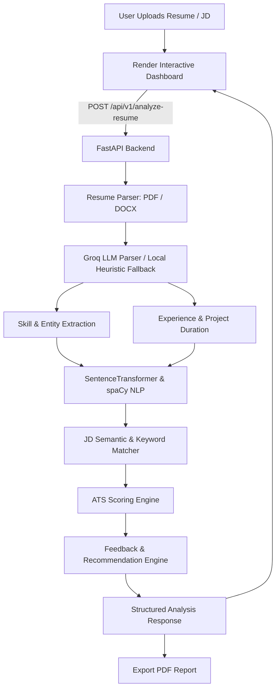

# 🎯 ATS Resume Scorer & Analyzer

An AI-powered Applicant Tracking System (ATS) resume analyzer and scorer. Evaluates resumes using NLP, semantic embeddings (`SentenceTransformers`), and Large Language Models (`Groq llama-3.3-70b-versatile`) against standard ATS criteria and job descriptions.

---

## 🏗️ Project Structure

```text
ATS_Score/
├── app.py                     # Streamlit frontend entrypoint
├── requirements.txt           # Python dependencies
├── .env.example               # Template for environment variables
├── .gitignore                 # Git ignore rules (secrets, caches, pycache)
├── README.md                  # Project documentation
│
├── backend/                   # FastAPI Backend Services
│   ├── main.py                # FastAPI app initialization, CORS, lifespan & router loading
│   ├── api/
│   │   ├── auth.py            # Authentication, JWT handling & mock auth mode
│   │   └── routes.py          # API endpoints (analyze-resume, history, admin, pdf)
│   ├── core/
│   │   └── config.py          # App configuration, weights, allowed origins & env loader
│   ├── database/
│   │   └── supabase_db.py     # Database client for history, analysis records & login logs
│   ├── models/
│   │   └── schemas.py         # Pydantic data models and API response schemas
│   ├── services/
│   │   ├── ats_scorer.py      # Core ATS scoring algorithm (weights & sub-scores)
│   │   ├── feedback_engine.py # Actionable feedback & critical issue generator
│   │   ├── groq_parser.py     # Groq LLM parser (llama-3.3-70b) + offline fallback
│   │   ├── jd_matcher.py      # Job Description vs Resume semantic similarity matcher
│   │   ├── pdf_export.py      # PDF document compiler from HTML templates
│   │   ├── recommendation_engine.py # Priority-based recommendations
│   │   ├── report_generator.py # Jinja2 HTML report generator
│   │   ├── resume_analyzer.py  # Full analysis pipeline orchestrator
│   │   └── resume_parser.py    # PDF & DOCX file reader (pdfplumber, pypdf, docx)
│   ├── templates/             # Jinja2 HTML templates for PDF reports
│   │   ├── action_items.html
│   │   ├── jd_comparison.html
│   │   ├── quick_actions.html
│   │   └── summary.html
│   └── utils/
│       ├── file_utils.py      # Helper utilities, error wrappers & defaults
│       └── matching.py        # RapidFuzz / Difflib string matching & normalization
│
├── frontend/                  # Streamlit Web Application
│   ├── assets/
│   │   └── styles.css         # Custom UI styles and themes
│   ├── components/            # Reusable UI dashboard widgets
│   │   ├── action_items.py    # Action item checklists
│   │   ├── dashboard.py       # Main results dashboard view
│   │   ├── detailed_feedback.py # Section-by-section breakdown
│   │   ├── jd_comparison.py   # Job description match visualizer
│   │   ├── recommendations.py # High-impact suggestions
│   │   ├── score_display.py   # Radial/metric score displays
│   │   ├── skill_validation.py # Skill-to-project validation cards
│   │   └── strengths_issues.py # Strengths and critical issues summary
│   ├── services/
│   │   ├── api_client.py      # HTTP client communicating with FastAPI backend
│   │   └── supabase_client.py # Client-side auth, sessions & OAuth handling
│   └── views/
│       ├── history.py         # Past analyses history viewer
│       ├── landing.py         # Welcome page & feature overview
│       ├── owner.py           # Admin / Owner dashboard
│       ├── resources.py       # Resume writing resources and tips
│       ├── scorer.py          # Main resume upload & analysis view
│       └── streamlit_app.py   # Streamlit multi-view router & sidebar
│
└── supabase/
    └── schema.sql             # SQL schema for Supabase database tables & RLS
```

---

## ⚡ Architecture Flow



---

## 🚀 Getting Started

### 1. Prerequisites
- Python 3.10+
- (Optional) Free [Groq API Key](https://console.groq.com/keys)

### 2. Installation
```bash
git clone https://github.com/Padmalochan512/ATS_Score.git
cd ATS_Score
pip install -r requirements.txt
```

### 3. Environment Configuration
Copy the `.env.example` file to `.env`:
```bash
cp .env.example .env
```
Update your `.env`:
```env
GROQ_API_KEY=your_groq_api_key_here
BACKEND_URL=http://localhost:8000
ENABLE_MOCK_AUTH=true
```

---

## 🖥️ Running Locally

Run both the **FastAPI Backend** and **Streamlit Frontend**:

### Terminal 1: Backend API
```bash
uvicorn backend.main:app --host 0.0.0.0 --port 8000 --reload
```
- Swagger API Docs: [http://localhost:8000/docs](http://localhost:8000/docs)

### Terminal 2: Streamlit UI
```bash
streamlit run app.py
```
- Web Application: [http://localhost:8501](http://localhost:8501)

---

## 📊 ATS Scoring Criteria

| Category | Weight | Description |
| :--- | :---: | :--- |
| **Formatting & Structure** | 20% | Standard section headers, readable contact information, parseable layouts |
| **Keyword Density** | 25% | Industry and role-specific technical and soft keywords |
| **Content Quality** | 25% | Action verbs, measurable metrics, and impact statements |
| **Skill Validation** | 15% | Cross-referencing listed skills with project descriptions and work history |
| **ATS Compatibility** | 15% | Standard fonts, single-column parsing, no unparseable elements |
